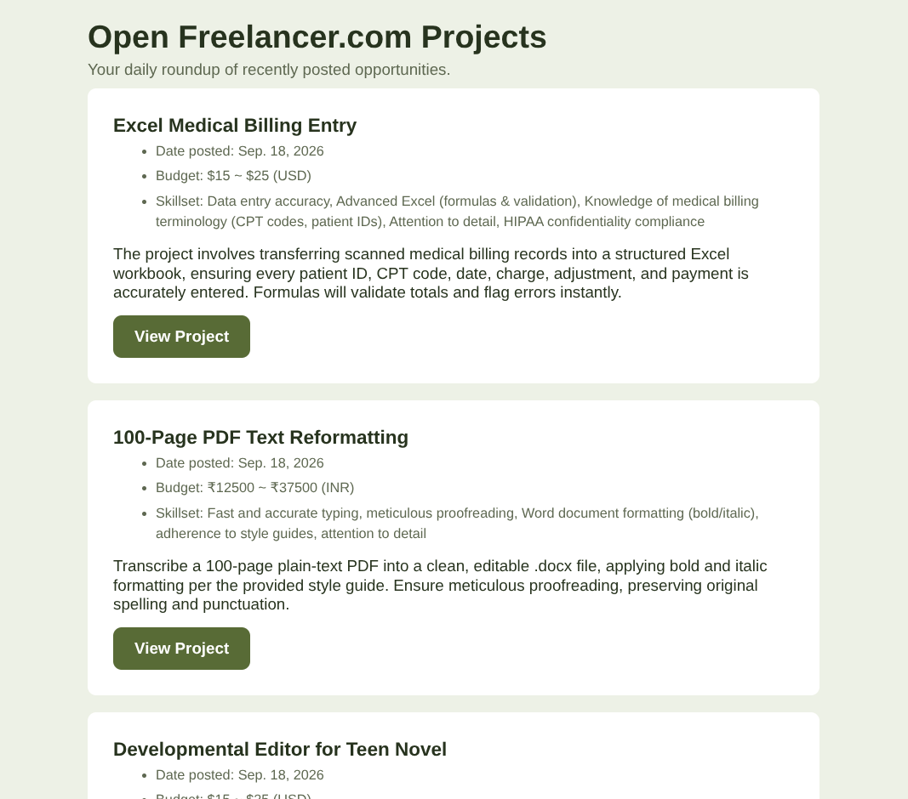
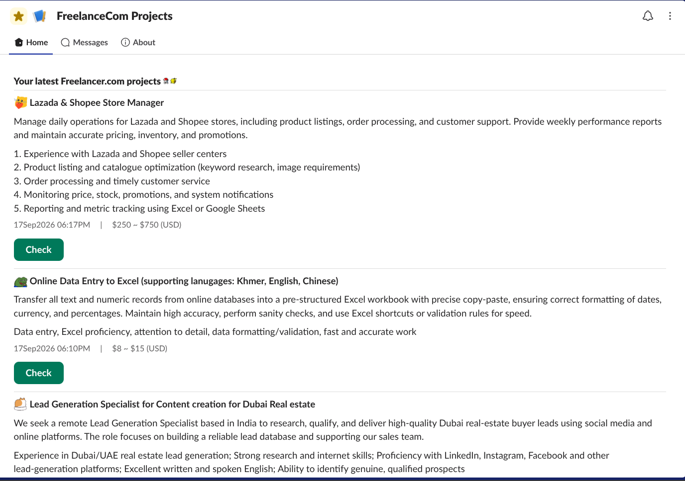

import Workflow from '@components/Workflow.astro'

## Problem

Having access to the latest projects from Freelancer.com is a huge advantage. The email notification is only sent daily, does not include all new projects, and provides incomplete description.

## Solution

This workflow queries all active Freelancer.com projects updated from the last eight hours. An AI agent summarizes the project description and lists required skillsets for the project. The data is stored in an n8n data table to make it accessible to multiple workflows.

## Tech Stack

- n8n
- REST API ( [Freelancer.com API](https://developers.freelancer.com/docs) )
- AI Prompt

## Node Descriptions

<Workflow file="freelancerProjects" />

| Node | Details |
| --- | --- |
| GetUserInfo | Fetches the user's information. The `jobs` query parameter is set to `true` to include full information about the user's skills.  |
| SplitJobs | Outputs the user's `jobs` information. |
| LoopJobs | Loops the *GetFreelanceProjects* node against each *job.id*. The three-second Wait node helps avoid hitting API limits. |
| GetFreelanceProjects | 
Fetches all active projects filtered with the following query parameters: 
 <ul><li>`languages[]` : `en`</li><li>`full_description` : `true` - Include the full description of the project.</li><li>`jobs[]` : `job.id` - Uses the *job.id* from the item in the current loop.</li><li>`from_time` : `$now.minus({ hours: 8 })` - Filter projects updated in the past 8 hours.</li><li>`limit` : `100`</li></ul>

 |
| GetProjectsObject | Collects all queried projects. |
| RemoveDuplicateProjects | Removes duplicate projects by *project.id*. |
| SetProjectFields | Extracts the following fields: `title`, `currency`, `description`, `budget`, `time_submitted`, `seo_url`, and `id`. |
| LoopProjects | Loops one project every 15 seconds to optimize AI token use. |
| AnalyzeProjectDetails | The AI agent that: <ul><li>Summarizes the job description.</li><li>Lists five required skills for the project.</li></ul> |
| ProjectSummary | Parses the AI agent's output as `summary` and `skills`. |
| RemoveEmptyItems | Filters out items with null values for `summary` and/or `skills`. |
| UpsertProjectData | Adds new project information to an n8n data table and updates existing projects. |

## Use cases

### Automated Email Delivery

* A scheduled n8n automation workflow retrieves new freelance opportunities from the data table, generates responsive HTML/CSS email content, and delivers formatted project alerts through Gmail.
* JavaScript expressions are used to dynamically populate project titles, budgets, skill sets, summaries, dates, and direct project links.
* After delivery, the workflow updates each record to prevent duplicate notifications, reducing manual monitoring and ensuring new opportunities are surfaced consistently.

### Update Slack App Home with Latest Open Freelance.com Projects

* Built an n8n automation workflow that delivers the latest projects to a custom Slack app home dashboard.
* Retrieves undelivered projects from an n8n data table, limits the results, and processes project information for display.
* Dynamically generates Slack Block Kit components with project summaries, skills, budgets, posting dates, and direct project links.
* Uses the Slack API, HTTP requests, JavaScript expressions, and a reusable n8n sub-workflow to publish and enhance the project dashboard.

## Challenges

- The workflow is locally-hosted (community version) and lacks some features from the paid version.
- The chat model is on free tier with limited resources (e.g., TPM, RPM), causing the workflow to run into 'over limit' errors.
- The `jobs[]` query parameter only accepts a single value, thus requiring looping.

## Future Improvements

- Optimize query parameters and item filtering to maximize resource usage for the chat model.
- Add more information for the AI agent to process.
- Refine the AI agent's prompt.